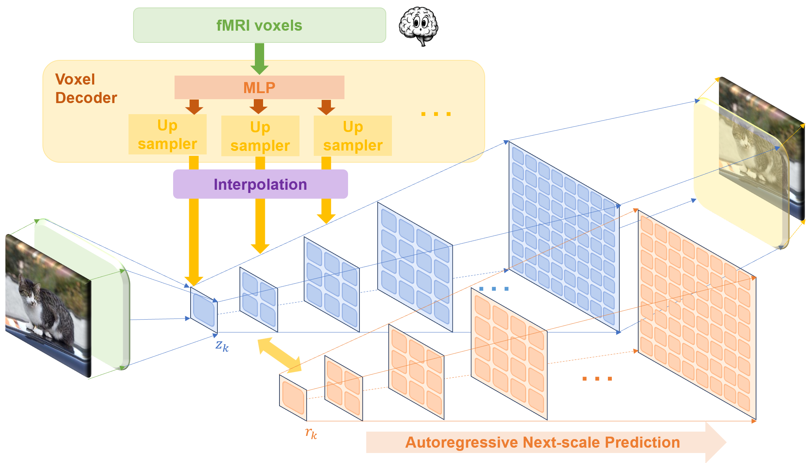
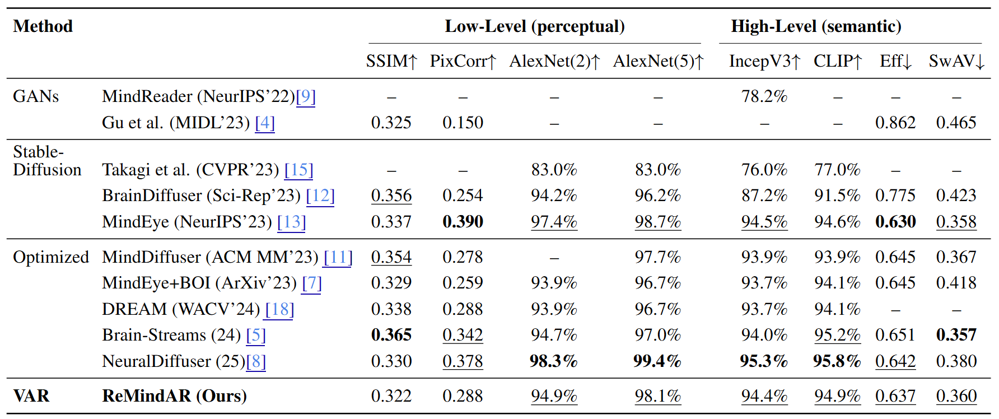

# ReMindAR: Reconstruct Mind Autoregressively

In this work, we propose the first autoregressive (AR)-based framework for visual reconstruction from fMRI signals, built upon the Visual Autoregressive Model (VAR).

For technical details and further analysis, please see the report `ReMindAR_report.pdf`.

## 👣What's new? 

### First autoregressive (AR)-based framework:

The model first decodes fMRI voxel data into multi-scale latent features using an MLP and upsampling modules. These features are then used to guide a visual autoregressive (VAR) model, which progressively predicts finer-scale representations and reconstructs the final image.

Overview of the proposed AR-based fMRI-to-image reconstruction pipeline



### Reconstruction performance:

Results generated in the VAR pipeline.


Results generated in the joint pipeline (VAR pipeline and CLIP pipeline).


### Quantitative performance:

Comparison of ReMindAR’s reconstruction performance on perceptual and semantic evaluation metrics against other models.



## Installation instructions

1. Agree to the Natural Scenes Dataset's [Terms and Conditions](https://cvnlab.slite.page/p/IB6BSeW_7o/Terms-and-Conditions) and fill out the [NSD Data Access form](https://forms.gle/xue2bCdM9LaFNMeb7)
2. Download this repository: `git clone https://github.com/99ninew/ReMindAR.git`
3. Run `set.up` to create a conda environment that contains all the necessary packages required  to run our codes. Then, activate the environment with `conda activate remindar`

```cmd
cd src
. setup.sh
```

## General information

This repository contains Python files and Jupytor notebooks for

1. Defining the VAR model (src/VAR)
2. Training ReMindAR's VAR pipeline and obtaining initial reconstructions from brain activity (src/train_with_var.py)
3. Training ReMindAR's CLIP pipeline (src/train_with_clip.py)
4. Reconstructing images from fMRI data using the trained model (src/Reconstructions.ipynb)
5. Evaluating reconstructions against the ground truth stimuli using various low-level and high-level metrics (src/Reconstruction_Metrics.ipynb)

Besides, all the above Jupytor notebooks have corresponding python files. 

## Honor Code

We refer to the high-level pipeline training and evaluation methods outlined in the [MindEye](https://github.com/MedARC-AI/fMRI-reconstruction-NSD) Github repository.